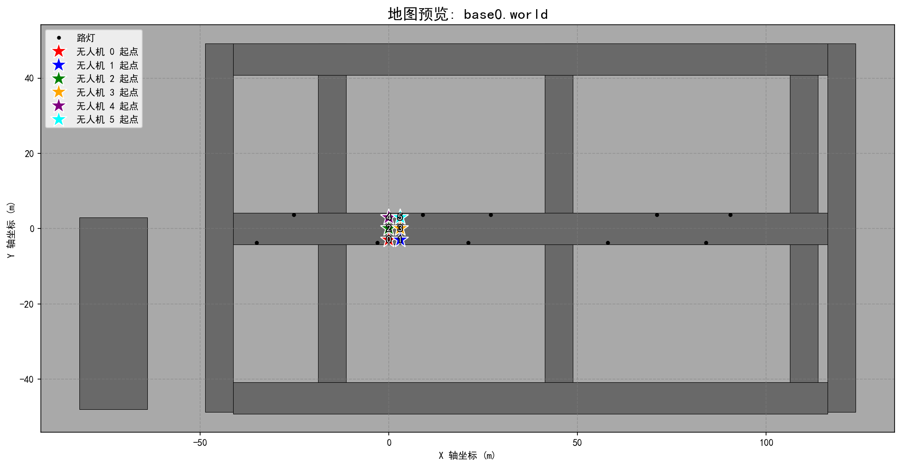
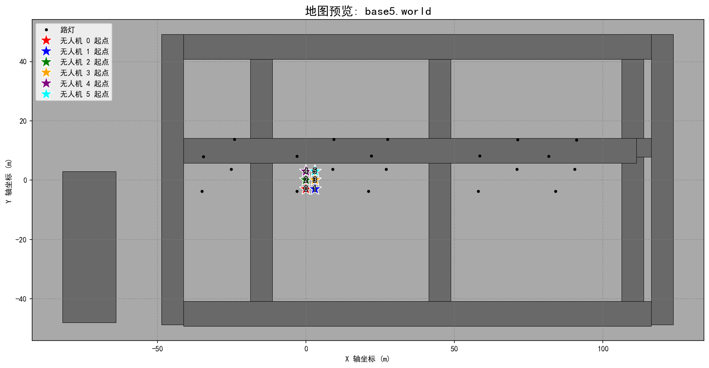
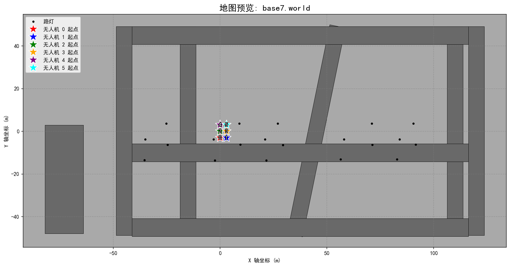

# 2025 中国机器人大赛多旋翼无人机集群搜索仿真——ZZU_FLY代码文档

## 1.项目结构

```txt
ZZU_FLY
	|____src
			|_______gazebo相关插件，非算法核心部分
			|_______gimbal # 云台控制
            |_______look_up # 目标管理模块
            |_______mix_nav
            			   |_______fly # 起飞模块
            			   |_______simple_navigator #导航模块
            			   |_______task_manager # 发布目标点
            |_______pose_init # 输出map坐标系下无人机的实时位姿
            |_______tracking # 目标跟踪模块
            |_______transform_tree # 自定义tf广播模块
            |_______yolo # 目标识别及解算模块
    |_______waypoint # 地图可视画工具，可以用于快速浏览地图和设置路径点
    Others(launch文件与无人机sdf)
        |_______robocup_zzufly.launch
        |_______typhoon_h480_zzufly
```


## 2. 核心思路

比赛中一共有17张地图，并且完全开源，每个队伍每次尝试都会从这17张地图中随机抽取一张进行搜索；我们观察发现按照中间主干道道路位置不同，地图可以归纳成三类：

主干道居中（middle）:

主干道偏上(up):



主干道偏下（down):



实力有限，我们没有开发 （~~抄开源~~） 出像样的自主探索算法，由于目标理论上不会进入房屋，且地图相对固定，因此采用定点巡航模式沿大路进行搜寻。

首先，用veiw.py设置好每类地图的路径点，输出为mission_up/middle/down/bp.json文件，并放入task_manager的launch文件夹下，

使用fly模块起飞后，会自动将控制权交给导航模块，同时yolo识别模块开始工作，当发现目标时，跟踪模块会向总控请求控制权，同时导航进入中断模式，记录断点坐标；当目标消除后，追踪模块将控制权重新交回，继续巡航… 以此类推，最终完成所有任务。

## 3. 运行和使用

### （1）编译：

本项目结构较为简单，应该没有用到什么抽象的包，因此

```bash
cd ~/ZZU_FLY
rm -rf devel builds logs
catkin build
```

即可顺利完成编译

**值得一提的是gazebo_ros_actor_plugin，是行人运动插件，gazebo_ros_pkgs是执行xtdrone 一键安装脚本安装好的，如果自己运行算法+仿真的话，不建议删除**

### （2）使用:

*根目录下的所有一键启动脚本都是为docker中的tmux设计的，本地运行需要转换才能使用*

为了应对不同情况，我们设置了四个启动脚本，每个脚本仅有

```bash
echo "定点巡航"
run_in_new_pane "flight_points" "source $HOME/ZZU_FLY/devel/setup.bash && roslaunch task_manager task.launch num_drones:=6 mission_filename:=mission_down.json"
sleep 2
```

这里的任务json文件不同

其中`1.sh`对应的json是mission_down

`2.sh` 对应的json是mission_middle

`3.sh `对应的json是mission_up

`bp.sh` 对应的json是mission_bp，(即backup方案，在该方案下，无人机仅会搜索地图边缘确定的大路以及生成时所在的那条路，不会搜索中间主干道，适配所有地图，但是效率比较低下，为极端条件设计，基本不会用到)

eg:   运行

```bash
bash 1.sh
```

即可坐在一边，观看无人机勤劳地完成任务了！！！

## 4. 写在最后

这次项目，让我从一个ros小白成功进化成一个入门级玩家，对工程开发有了更深的理解，感谢崔龙飞学长，没有他总体部署和解决“卡脖子”问题，这套代码不可能走到最后，感谢冯一博同学，他解决了docker环境问题，正是有了docker,我们的代码才能无报错的完成30min的精彩表演，最后感谢Gemini, deepseek, 豆包，它们为我提供思路，答疑解惑，是真正的良师益友。

希望这个项目成为一个留念，支撑我向更大的挑战冲击！